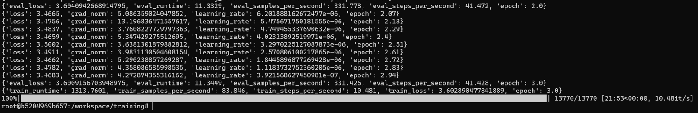

# Training Log — TinyGPT

This is a snapshot of a successful training session performing on a local VM using GPU passthrough.



---

## 1 · Quick Start (inside Docker)

### One‑Shot Training
```bash
docker run --rm --gpus all -e MODE=train -v $(pwd):/workspace ai-opt-lab
```

---

## 2 · Script overview (`train_tiny_gpt.py`)

| Step              | What happens                                                                       |
| ----------------- | ---------------------------------------------------------------------------------- |
| **Load model**    | `distilgpt2` from HuggingFace Hub                                                  |
| **Fix pad token** | If missing, set `tokenizer.pad_token = tokenizer.eos_token` (avoids padding error) |
| **Dataset**       | Default = `wikitext‑2-raw-v1`; switch to TinyStories by editing the script         |
| **TrainingArgs**  | 3 epochs · batch 8 · LR 2e‑5 · logs → `./logs`                                     |
| **TensorBoard**   | `report_to="tensorboard"` — run `tensorboard --logdir ./logs`                      |
| **Output**        | Final model in `training/tiny-gpt2-finetuned/`                                     |

---

## 3 · Monitoring with TensorBoard

```bash
tensorboard --logdir training/logs --port 6006
# open http://localhost:6006
```

---

## 4 · Switching dataset

```python
# in train_tiny_gpt.py
dataset = load_dataset("roneneldan/TinyStories", "all")
```

---

## 5 · Environment

* GPU : RTX 3070 passthrough
* CUDA 12.1 · PyTorch 2.2 · Transformers 4.42

---

## 🇫🇷 Résumé rapide

* Entraînement :

  ```bash
  docker run --rm --gpus all -e MODE=train -v $(pwd):/workspace ai-opt-lab
  ```
* Visualisation :

  ```bash
  tensorboard --logdir training/logs
  ```
* Modifiez le dataset/hyperparams dans le script puis relancez.
